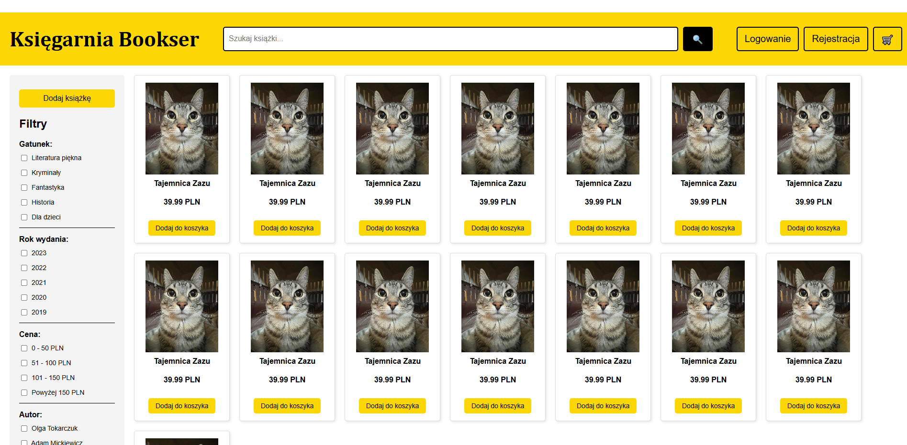
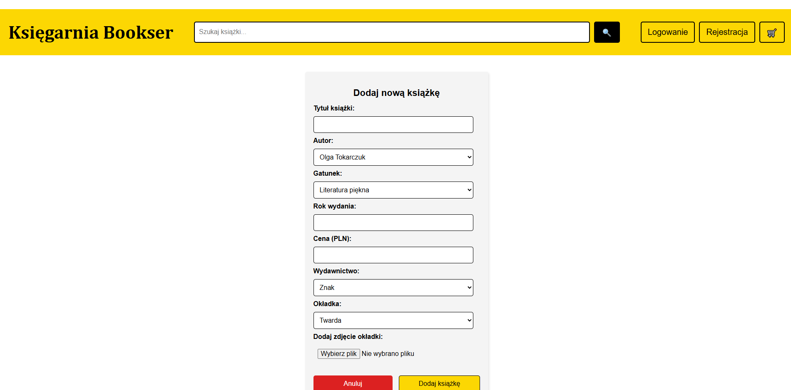
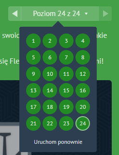
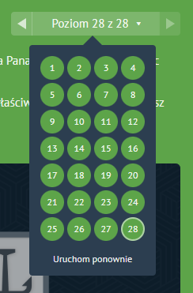

#  Księgarnia Bookser

Projekt strony internetowej księgarni **Bookser**, umożliwiający przeglądanie książek oraz dodawanie nowych pozycji.

## Podgląd strony

## Technologie
- HTML
- CSS

## Wyniki gier

## Autor
Projekt stworzony przez **Dawid Kawałko**.