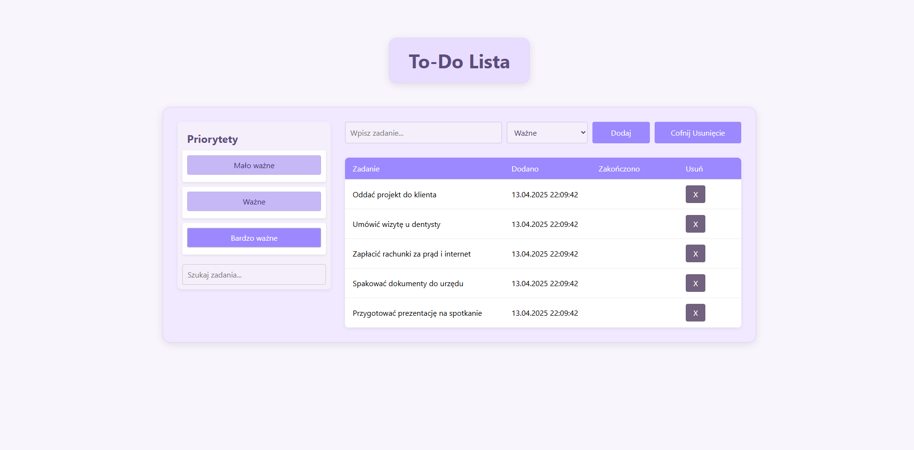
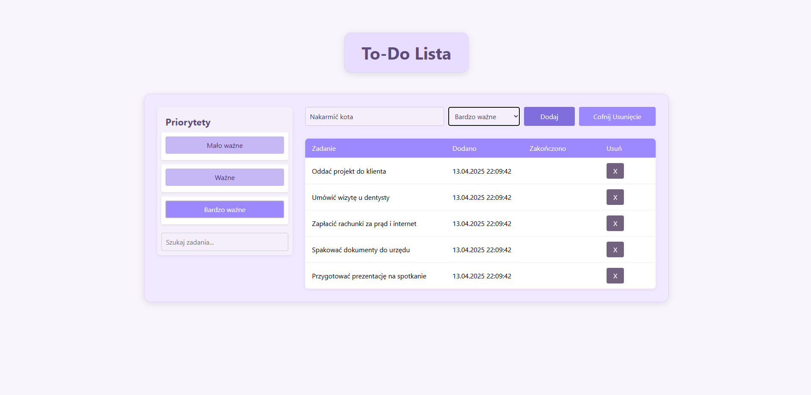
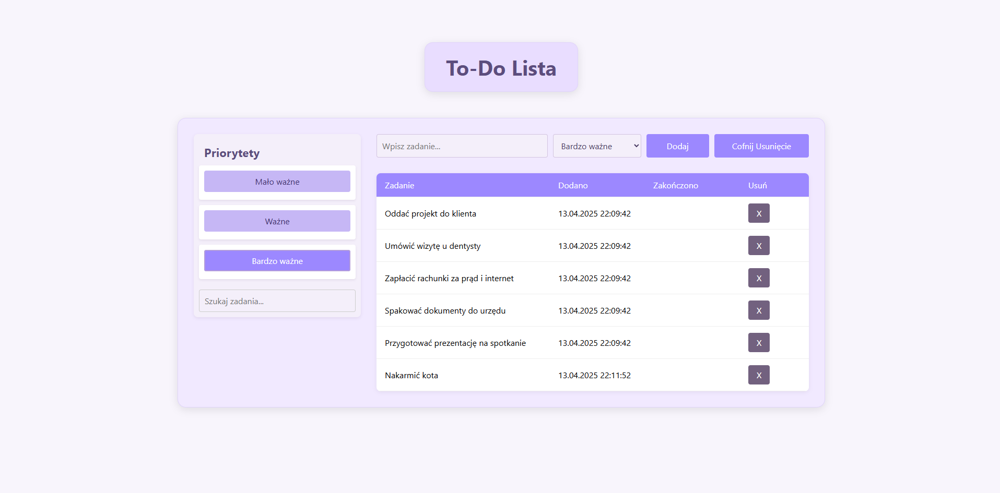

#  ToDo lista

Projekt strony internetowej prostej **ToDo listy**, umożliwiający dodawanie/usuwanie zadań oraz zaznaczanie ich jako gotowe.

## Podgląd strony

## Technologie
- HTML
- CSS
- JavaScript

## Autor
Projekt stworzony przez **Dawid Kawałko**.